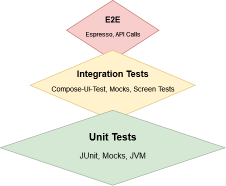
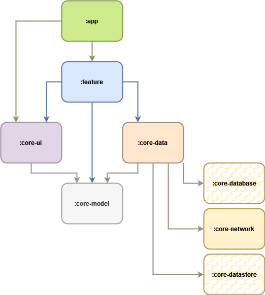

# Rindus coding task

## Description
Coding challenge app created for Rindus. It meets the folowing requirements:

- Create an android project that uses kotlin as a programming language.
- Use an architecture pattern of your choice that fits to the app.
- Tab 1 (Weather): Please use the free API of https://openweathermap.org/ show the current weather in the city of Dusseldorf and the forecast for the next few days (3 or 5 are enough).
- Tab 2 (Webview and spinner): The second tab should include a webview that navigates to the C&A homepage, allowing the user to interact with it, and every time a navigation is made, a view should appear that blocks the webview and shows an activity indicator (or similar) during the time the web is loading.
 
Other details.
- It is not necessary to overdevelop the visual content, you can use layout-xml’s or jetpack compose for creating the UI.
- You can use third party libraries.
- It will be appreciated the writing of a Readme.md document or similar if it is decided to change something of what was requested, why it was done and with what result.

## Development Environment of the Application

### Kotlin
It is entirely written in Kotlin.

### Jetpack Compose
It uses the Unidirectional Data Flow (UDF) design pattern where state flows down and events flow up.

### Dependency Injection
DI for creating a good app architecture foundation, better code reusability and ease of testing.

### Gradle setup
It is done with buildSrc module, Kotlin DSL and precompiled script plugins.

### Testing strategy
The idea is to give priority to **Unit Tests**, followed by the **Integration Tests** in which screens and common views must be tested in isolation and finally, the **E2E Tests**. Not many though, just the critical ones because this kind of tests tend to be very flaky.

## Architecture

It is a modular app that uses the repository pattern in the data layer and MVVM pattern in the UI layer along with the previously commented UDF.

### Modules
- **:app** -> Contains the Application class, the MainActivity, the AppNavigation and, the different buildTypes and flavors the app could have.
- **:buildSrc** -> Contains the precompiled script plugins, the dependencies and project configuration.
- **:core-network** -> Contains the REST client and DTOs. It could also contain other type of client, like Apollo for GraphQl.
- **:core-data** -> Contains mainly the repositories which in this case only communicate with :core-network, but it could also fetch data from :core-database and :core-datastore.
- **:core-model** -> Contains the domain model.
- **:core-ui** -> Contains the theme, the common views and the resources shared across the application.
- **:feature-x** -> Contains the views and logic for a determinate feature.

The dependency between modules is as follows:

### Plugins and tools used
- Json to Kotlin class plugin: for converting Json into Kotlin data class code quickly.
- JLLeitschuh ktlint gradle plugin: creates convenient tasks in your Gradle project that run ktlint checks or do code auto format.
- ben-manes gradle versions plugin: provides a task to determine which dependencies have updates.
